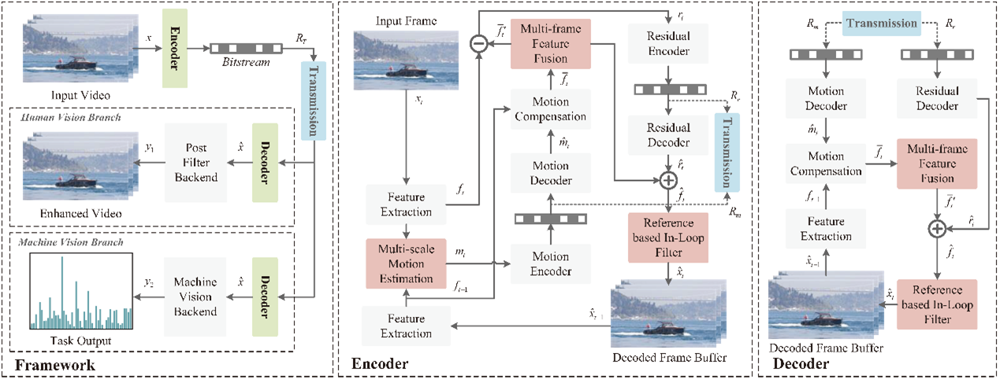
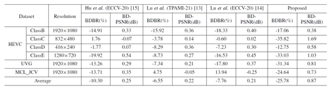
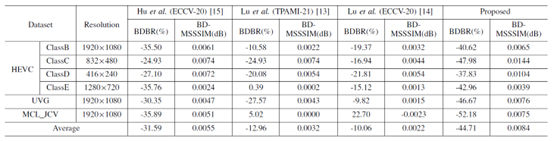
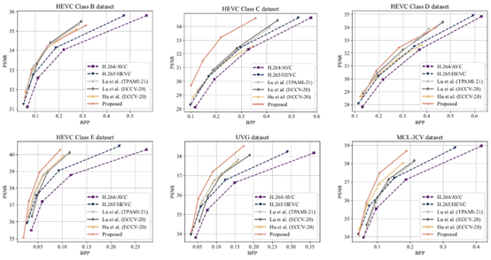
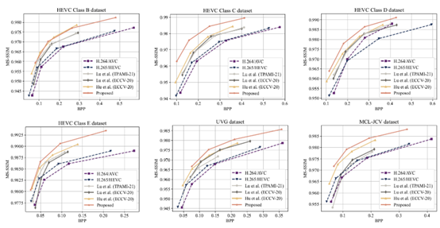
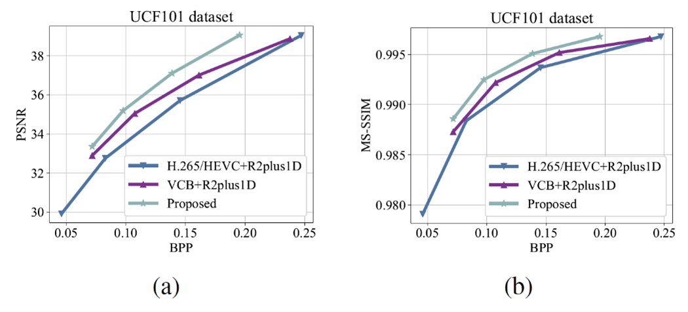
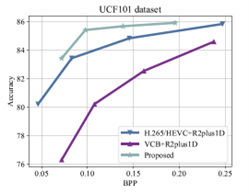

# Task-Driven Video Compression for Humans and Machines: Framework Design and Optimization

This is the source code for our paper [Task-Driven Video Compression for Humans and Machines: Framework Design and Optimization].

## Overview:
<p style="text-align:justify; text-justify:inter-ideograph;">
Learned video compression has developed rapidly and achieved impressive progress in recent years. Despite efficient compression performance, existing signal fidelity oriented or semantic fidelity oriented video compression methods limit the capability to meet the requirements of both machine and human vision. To address this problem, a task-driven video compression framework is proposed to flexibly support vision tasks for both human vision and machine vision. Specifically, to improve the compression performance, the backbone of the video compression framework is optimized by using three novel modules, including multi-scale motion estimation, multi-frame feature fusion, and reference based in-loop filters. Then, based on the proposed efficient compression backbone, a task-driven optimization approach is designed to achieve the trade-off between signal fidelity oriented compression and semantic fidelity oriented compression. Moreover, a post-filter module is employed for the framework to further improve the performance of the human vision branch. Finally, rate-distortion performance, rate-accuracy performance, and subjective quality are employed as the evaluation metrics, and experimental results show the superiority of the proposed framework for both human vision and machine vision.
</p>

## Method:
<p style="text-align:justify; text-justify:inter-ideograph;">
An overview of the proposed TDVC framework is shown in Fig. 1. First, a task-driven video compression framework is proposed, which exploits compression model and optimization technique to extract compact representations from video for both human perception and machine analysis. Second, we design a compression model including three novel modules: multi-scale motion estimation to capture explicit motion representation, multi-frame feature fusion to obtain accurate predicted features, and reference based in-loop filter to refine reconstructed features. Third, a task-driven optimization approach is devised to optimize the proposed video compression framework for both human and machine vision tasks, which can achieve a trade-off between signal fidelity and semantic fidelity. Finally, the proposed task-driven video compression framework is applied to the task of action recognition, and the experimental results verify the impressive performances achieved by the proposed framework.
</p>

<div align=center></div>
Fig. 1. The architecture of the proposed task-driven video compression framework.

## Results:
<p style="text-align:justify; text-justify:inter-ideograph;">
For evaluating the proposed video compression backbone, the rate-distortion performance is calculated. Specifically, the metric of bits per pixel (BPP) is used to evaluate the number of bits required for motion compression and residual compression. Peak signal-to-noise ratio (PSNR) and multi-scale structural similarity (MS-SSIM) are used to evaluate the distortion between the reconstructed frames and the raw frames. The comparison results are summarized in Table 1 and Table 2. Moreover, to intuitively show the rate-distortion performance, the rate-distortion curves of the competing methods on different datasets are presented in Fig. 2 and Fig. 3. For evaluating the entire proposed framework, BPP and machine task accuracy are used to measure rate-accuracy performance for machine vision, while BPP and video reconstruction distortion are used to measure rate-distortion performance for human vision. The results of the rate-distortion performance comparison and rate-accuracy performance comparison are shown in Fig. 4 and Fig. 5, respectively.
</p>

Table 1
BDBR (%) and BD-PSNR (dB) results of the proposed video compression backbone and other competing compression methods when compared to H.265/HEVC.
<div align=center></div>

Table 2
BDBR (%) and BD-MSSSIM (dB) results of the proposed video compression backbone and other competing compression methods when compared to H.265/HEVC.
<div align=center></div>

<div align=center></div>
Fig. 2. Performance comparison of video compression methods in terms of BPP and PSNR.

<div align=center></div>
Fig. 3. Performance comparison of video compression methods in terms of BPP and MS-SSIM.

<div align=center></div>
Fig. 4. Rate-distortion performance comparison of different video compression frameworks. (a) Distortion measured by PSNR. (b) Distortion measured by MS-SSIM.

<div align=center></div>
Fig. 5. Rate-accuracy performance comparison of different video compression frameworks.

## Data preparation

### Process commands for the video compression backbone
#### Training data
1. Download the Vimeo90k dataset ([Download link](http://data.csail.mit.edu/tofu/dataset/vimeo_septuplet.zip)) .
2. Unzip the dataset into ./data/.
3. Run scripts in tools/process to generate
#### Validation data
1. Download the UVG dataset ([Download link](http://ultravideo.cs.tut.fi/#testsequences_x)).
2. Download the HEVC dataset ([Download link](ftp://ftp.tnt.uni-hannover.de/testsequences)).
3. Download the MCL\_JCV dataset ([Download link](http://mcl.usc.edu/mcl-jcv-dataset/)).
4. Runn scripts in tools/preprocess to generate I-frames.
### Process commands for the action recognition 
#### Training data & Validation data
1. Download the UCF-101 dataset ([Download link](https://www.crcv.ucf.edu/data/UCF101.php)) .
2. Runn scripts in app/VideoClassification/preprocess to generate compressed frames.

## Training
The video compression backbone is first trained as a pre-trained model for the overall framework.
### Training for the video compression backbone

```
cd tools
python train.py --cfg ../cfg/train.yaml
```

### Training for the overall framework 

```
cd app/VideoClassification
python train_cls.py --cfg cfg/compress.yaml
python train_sr.py --cfg cfg/ehc.yaml
```

## Testing
```
cd app/VideoClassification
python predict.py
python predict_sr.py
```

## Citation:
Please cite the following paper if you find this work useful:

Xiaokai Yi, Hanli Wang, Sam Kwong and C.-C. Jay Kuo. Task-Driven Video Compression for Humans and Machines: Framework Design and Optimization, IEEE Transactions on Multimedia, accepted, 2023.
